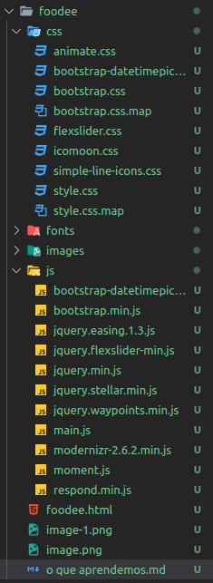
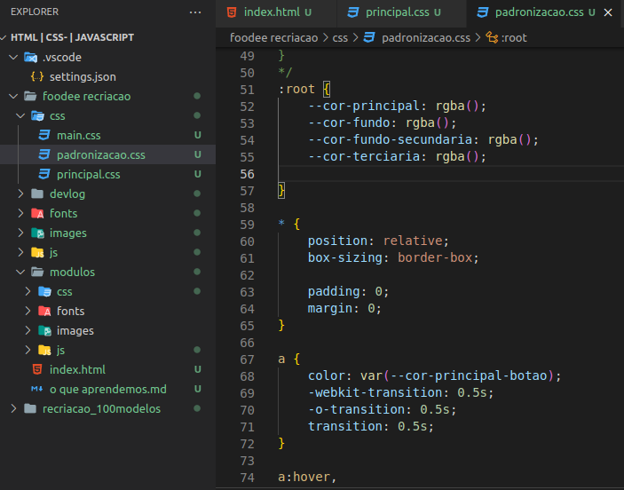
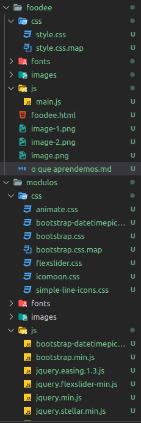
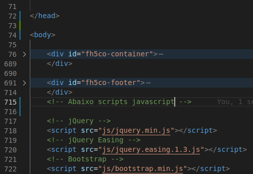
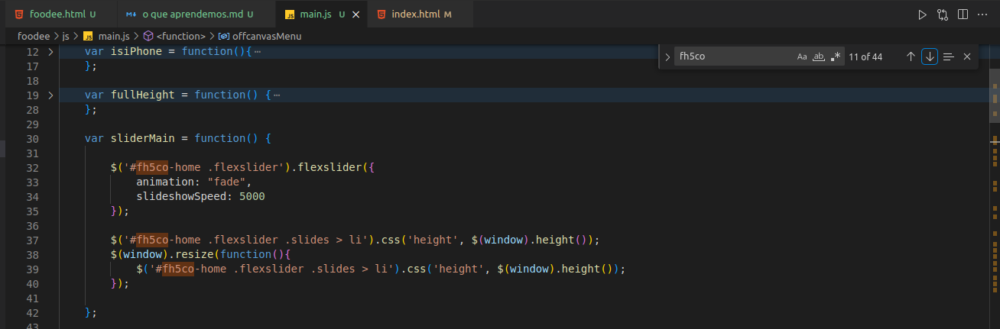
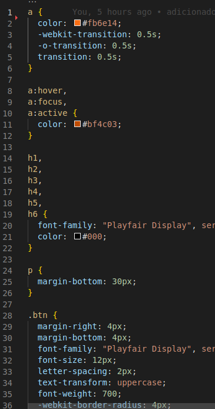
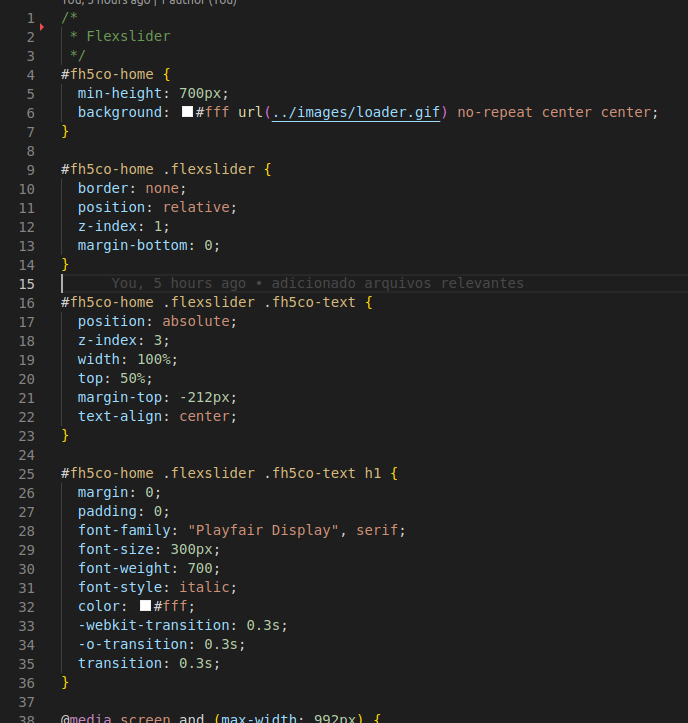
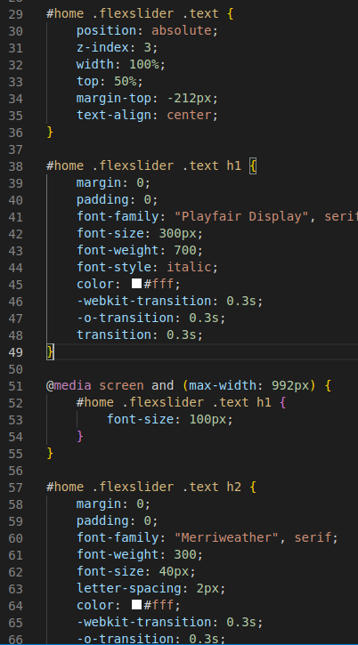
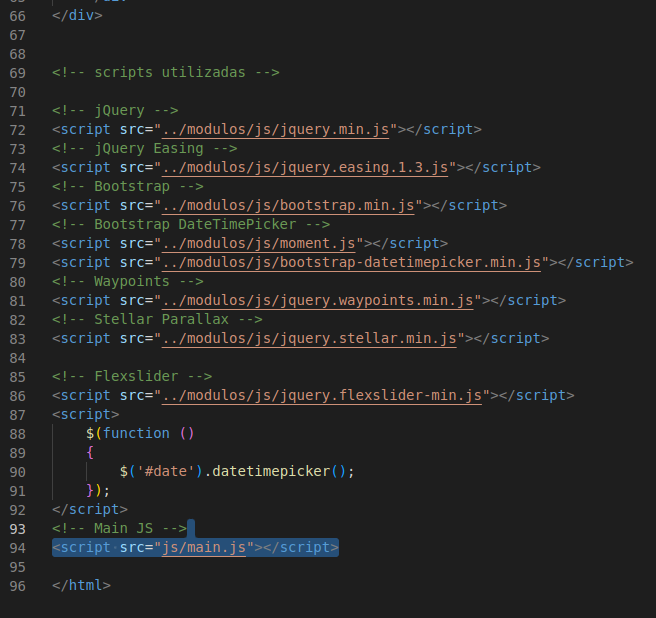
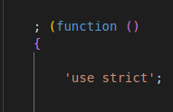

# Relatório de desenvolvimento por etapa.

### Antes de começarmos.

se você é um iniciante que nem eu talvez fique confuso com as minhas ferramentas...
fique tranquilo.

estou utilizando um editor de texto chamado Visual Studio Code por ser leve e ter muita coisa integrada, me ajuda não tendo que abrir
1500 janelas e ficar trocando entre elas e de bonus tenho extensões.

durante minha aventura tu vai perceber que eu tenho icones diferentes do teu: são as extensões. aqui vai uma lista da extensões que são "relevantes" para o projeto que vamos mecher, não recomendo ficar muito tempo buscando elas, o editor fica mais e mais pesado a cada nova extensão.
> HTML CSS Suport
>
> IntelliSense for CSS class names in HTML
> 
> Material Icon Theme
>
> Live Server
>

se quiser utilizar outras ferramentas como neo-vim( se tu gosta do msdos ), sublime, visual studio, qualquer IDE do jetbrains ou até mesmo o bloco
de notas padrão do seu computador pode ir tranquilo.

e sim... existem dois visual studios: 

>visual studio é uma IDE para a linguagem C# e para o framework .NET.
>
>visual studio code é um editor de texto.

# Vamos começ- meu deus... que bagunça...
Esse projeto esta sendo construido por cima de uma livraria de modelos de 2016, muita coisa mudou desde lá: jquery por exemplo é inutil*, não só por que utilizamos react mas tambem por que a linguagem javascript evoluiu muito.

uma coisa interessante de se fazer é separar os componentes utilizados em pastas diferentes. isso inclui as livrarias de terceiros como bootstrap, jquery e icomoon.

uma coisa que vou fazer neste projeto é separar os arquivos de terceiros para uma pasta "módulos", facilita depois por que posso só chamar dos módulos, pensa como se fosse o equivalente á pasta "node_modules" de um projeto com NPM.

se quiser tu pode criar teus próprios módulos, especificar ainda mais a pasta de módulos, enfim: se tu acha que vai usar em mais de um projeto, deixa salvo ali.



uma coisa legal é que nessas versões antigas das livrarias era comum querer "minificar" o código, então se tu abrir algumas dos arquivos de terceiros na pasta módulos tu vai ver que é possivel criar qualquer código em uma unica linha! normalmente esse processo de minificação não é mais tão essencial: com a criação do react foi normalizado o uso do webpacker, um componente que reune todos os arquivos javascript em um unico grandão, e então o react passa por um minificador. Tudo isso só teclando npm build no console, essa abstração nos permite ver que qualquer arquivo agora na pasta node_modules esta essencialmente cru.

pra ti iniciante, javascript é uma linguagem que ficou popular pelo nome parecido com java, não tem nenhuma semelhança entre as duas a ponto que java é uma linguagem compilada enquanto javascript é uma linguagem interpretada. 

vamos falar agora dos componentes utilizados no projeto: um projeto web não é muito diferente de um projeto desktop técnicamente HTML não é nescesariamente exclusivo da web, afinal é uma linguagem de FORMATAÇÃO. a web inteira na verdade é uma grande aplicação desktop em C que o usuário abre e conecta no nosso website onde controlamos esse aplicativo enviando comandos de formatação com html e css ou comandos lógicos com javascript.

como mencionei HTML e CSS são ferramentas de formatação, uma cria o esqueleto e a outra a carne. Em alguns sistemas operacionais como windows e algumas ditribuições linux é possivel instalar um plugin/driver de compatibilidade, permitindo por exemplo a criação e utilização de papeis de parede criados com html e css, alguns até animados com javascript.

falando em javascript ja se perguntou o que é o react? quando criamos um arquivo html temos algumas partes que vão ser renderizadas fixamente, chamamos esse arquivo html de DOM: Documento com Objetos do Modelo (forçei). uma coisa interessante é que  com javascript podemos criar elementos e então coloca-los como filhos de um elemento do DOM, estes elementos criados por javascript chamamos de elementos virtuais já que eles não estão escritos no disco dentro do HTML, mas sim na memória RAM usada pelo javascript.

se não entendeu a ideia é por que te falta prática com javascript conforme for utilizando eventualmente essa ideia vai só... fazer sentido.
uma grande porção da TI é assim, pelo menos comigo: por falta de prática não entendo uma ideia mas após usa-la por um tempo apenas entendo a teoria.

o unico motivo do por que utilizamos html e css pela web é por que foi padronizado assim desde o começo: é possivel construir um GUI utilizando essas tres linguagens para qualquer jogo ou aplicação destkop mas para isso precisamos de um adaptador, enquanto na web essas linguagens foram criadas justamente para serem a web junto ao php.

## começando.

perfeito, sabemos os principais componentes de qualquer website: html, css e javascript e temos um projeto organizado.

nesse primeiro projeto não vamos ter muuuito javascript, no máximo chamamos algumas livrarias de terceiro para compatibilidade ou algum elemento especifico. a menos que queira refazer o pacote na mão, seria uma ótima experiencia para aprender um pouco mais.

cada arquivo tem um detalhe especial sobre ele: html precisamos saber estruturar bem o projeto para facilitar nossa vida no css.

> no html precisamos saber estruturar bem, para facilitar nossa vida no css.
>
> no css precisamos aprender designs, coisas como cores, letras e formatos para agradar visualmente para o usuário.
>
> no javascript precisamos aprender a fazer as coisas parecerem "vivas" e profissionais de maneira facil, normalmente utilizando um componente css para auxiliar enquanto um componente html especifica e o javascript apenas faz sua ação.
>
> no final todos se juntam para fazer uma apresentação perfeita.

### CSS

vamos começar com o querido CSS, justamente por que gosto muito dele e por que o html tem alguns componentes chatos de se entender por agora.

o css funciona na base de especificidade: tu especifica o elemento que queres transformar e então aplica os estilos que achar nescessario.

por exemplo:

<div style="width:100%; background-color:green ; display:flex;">
	<div style="background-color:red;"> vou te educar custe o que custar.. </div>
</div>

para tu leitor apenas ve um texto com fundo vermelho, mas no fundo o html estruturou e apenas pedi para o css pintar de vermelho.
existem alguns valores extras como display:flex este apenas serve para pedir para todos os elementos dentro da tag pedindo para mostrar com flex ocuparem o menor espaço possivel e move-los para o canto esquerdo superior por padrão. width apenas faz o elemento ocupar 100% da linha ao qual ele é relativo, nesse caso a primeira div. abaixo o código que estou mencionando, tente reler este parágrafo e veja se consegue entender.

```html

<div style="width:100%; display:flex;">
	<div style="background-color:red;"> vou te educar custe o que custar.. </div>
</div>

```

percebe como css transforma esse texto chato em algo a mais? não achou legal? abra QUALQUER página na web, procure uma que te impressiona e posso te dizer com 100% de certeza que ela foi criada com css. a menos que no futuro utilizem outras técnologias, claro.

existem 3 maneiras principais para programarmos em css, a maneira que apresentei acima se chama css por linha. [se gostar desse tipo de desenvolvimento Tailwind](https://tailwindcss.com/) que é um framework que talves te interesse no futuro, ele é dedicado a fazer componentes html programados com css em linha, só toma cuidado pois ele usa uma optimização que apenas cospe um arquivo css com os estilos que são utilizados, então tu precisa constantemente rodar um comando pelo terminal ou chamar um file watcher para ti.

no css a regra principal é a seguinte: o que se aplica ao pai se aplica ao filho, cores, fontes, tamanho de fontes e similares são repassados para o filho. então se quiser dar uma fonte unica, começe por cima.

caso queira reutilizar seu esforço no css podemos utilizar classes e ids, ids são classes que só podem ser usadas por um unico elemento, um indentificador unico. a seguir eu refaço o mesmo comando anterior, porem com css em estilo indexado (pois ele esta no arquivo html)

```html
<div>
<style>

.container
{
	display:flex;
}

.filho-container
{
	background-color: red;
}

.verde{
	background-color: green;
}
</style>
	<div class="container verde">
		<div class="filho-container">
			oi, eu vou te ensinar custe o que custar.
		</div>
	</div>
</div>

```

nosso resultado:

<div>
	<style>
	.container
	{
		display:flex;
	}
	.filho-container
	{
		background-color: red;
	}
	.verde{
		background-color: green;
	}
	</style>
		<div class="container verde">
			<div class="filho-container">
				oi, eu vou te ensinar custe o que custar.
			</div>
		</div>
</div>

se tiver curiosidade temos a W3School para ensinar mais sobre os detalhes internos de todo componente web.

eu gosto de criar arquivos CSS com algumas variaveis para evitar bagunça no futuro: imagina começar com um tom de verde para então trocar de tom sem perceber.

para isso crio uma pasta chamada padronizacao.css nos meus projetos. nela eu coloco estilos para normalizar o css. margens e espaçamos? anulo todos. variaveis? crio no elemento raiz. padronização de botões e algumas animações básicas? feitas aqui.



a ideia principal é que normalmente numa página web utilizamos 3 cores principais:

> a cor primária, que será a cor do cabeçário ou qualquer <span style="color:yellow;">palavra chave.</span>
>
> a cor secundária, normalmente utilizada de fundo,<span style="color:white; background-color:black;"> para chamar atenção a um conjunto de informações importante.</span>
>
> e finalmente a cor terciária, normalmente usada para chamar atenção a uma ação que o usuário deve fazer ou está fazendo. algo como uma cor laranja de um botão em um site branco com fundos pretos, te convidando a clicar nele. se colocar um laranja mais forte quando o cursor esta por cima do botão esse chamado fica ainda mais convidativo.

<div>
<style>
	button
	{
		background-color:orange;
		padding:1rem;
		color:black;
		cursor:pointer;
		border: 5px solid black;
		transition: ease-in-out 0.2s all;
	}
	button:hover
	{
		background-color:darkorange;
	}
</style>
	<div>
		<button> Clique em mim! </button>
	</div>
</div>

claro, no mundo de UI UX essas regras não são fixas. nem no mundo backend existem regras fixas assim, mas o importante é não se afastar muito delas ou então o seu projeto vai deixar de parecer profissional, limpo, bonito e elegante e começar a parecer uma página web dos anos 90: esquecivel. tente brincar com ideias tambem: chatGPT recentemente esta testando uma página com cores brutalistas, sem transições de cores, preto e branco extremos.

depois de criado esses componentes básicos, gosto de deixar os componentes mais complexos para um segundo arquivo css que normalmente chamo de principal.css, este vai se encarregar de modificar classes e IDs.

gosto de importa o arquivo de padrnoização pra dentro do arquivo principal.css, assumindo que estão na mesma página:
```css 
@import url(./padronizacao.css);
```

vou dormir agora, boa noite.


animate.css -> uma livraria para animações. FANTASTICO!! eu vou salvar essa para mais projetos no futuro, simples de usar porem verbosa
me pergunto se existem livrarias melhores/mais novas utilizando o potencial do css em 2023.

bootstrap -> um clássico. simples e sempre util.
seria melhor utilizar tailwind por gosto pessoal, mas bootstrap tambem tem um lugar especial em mim.

flexslider -> uma livraria de carrosel ou sliders para a página que pode ser usada de maneiras criativas.

e depois de aplicar esta regra o projeto foi de confuso para... 
um projeto ainda confuso, mas que pelo menos é visivel e desmenbravel.
é por isso que em projetos modernos utiliza-se o NPM e a pasta node_modules: para evitar essa bagunça enorme.

por sorte o projeto é simples e não presisamos utilizar um webpacker: uma ferramenta que junta todo o javascript em um só arquivo gigante de 50 mil linhas. torna nossa experiencia de engenharia reversa um inferno MAS para o desenvolvedor é um paraiso já que ele permite separar o código por vários arquivos evitando bagunça.

 


---------------------------------------
# Entrado na página...

>- [Visualizar a página pronta]()
>- [Código fonte original](https://github.com/toidicode/template/tree/master/01-foodee)


irei criar a recriação no arquivo recriacao.html
talves eu venha a colocar os arquivos de css e javascript em uma pasta "recriacao" dentro de suas respectivas pastas caso tenha vários arquivos.


beleza, agora que a etapa mais importante esta concluida, podemos olhar para o projeto em si: recriar a página do [Foodee](https://github.toidicode.com/01-foodee/)

então... bela introdução... nossa isso vai ser chato de explicar...

um lembrete para só dar uma visualizada dentro do elemento header da página. todo aquele conteudo  é importante para integrar a página com redes sociais, chamar nossos arquivos de estilos e laaa no rodapé os nossos arquivos javascript. SIM é importante a ordem de como chamamos, pricipalmente para os arquivos javascript: alguns podem ser dependentes de outros.

mas indo para o importante: o corpo da página.



então. o esqueleto da página foi separado em 3 partes: 

- corpo visual
- rodapé

talves tu tenha percebido o div id="fh5co-container  no inicio da página do foode. então, da maneira como a página foi separada ele atua como nosso body. podemos até ignora-lo para testar componentes individuais MAS quando colocarmos tudo junto é melhor te-lo.


aquela introdução do [Foodee](https://github.toidicode.com/01-foodee/) é representada por este código:

```html

<div id="fh5co-home" class="js-fullheight" data-section="home">

			<div class="flexslider">

				<div class="fh5co-overlay"></div>
				<div class="fh5co-text">
					<div class="container">
						<div class="row">
							<h1 class="to-animate">foodee</h1>
							<h2 class="to-animate">Lovely Designed <span>by</span> <a href="http://freehtml5.co/"
									target="_blank">freehtml5.co</a></h2>
						</div>
					</div>
				</div>
				<ul class="slides">
					<li style="background-image: url(images/slide_1.jpg);" data-stellar-background-ratio="0.5"></li>
					<li style="background-image: url(images/slide_2.jpg);" data-stellar-background-ratio="0.5"></li>
					<li style="background-image: url(images/slide_3.jpg);" data-stellar-background-ratio="0.5"></li>
				</ul>

			</div>

		</div>

```

sim, a primeira vista tambem não entendi nada. mas a curiosidade me pegou: 

> por que temos fh5co? da onde isso surge?
>
> js-fullheight? oxe, 100vh existe, não é só usar isso?? 

vamos responder um a um: primeiramente o fh5co provavelmente é uma maneira de deixar visivel um elemento modificado pelo javascript.
indo no arquivo main.js e... bingo!



essa regra tambem se aplica para o arquivo CSS, é uma maneira do criador original de manter os estilos unicos para este site.

daqui podemos seguir por dois caminhos: análisar o css ou o javascript, de qualquer maneira iremos análisar ambos no final do dia.

## Introdução / Hero

vamos começar deixando o site bonitinho, podemos nos preucupar com as animações depois.

vamos começar inicializando alguns componentes, dando uma fonte padrão com tamanho, peso e altura da linha.

a introdução bonitinha é facil de se entender, de fato sem estilo ela é literalmente... um monte de linhas.
copiando e colando o html para o nosso documento ficamos com essa sequencia de tags... tentarei entender o por que deles separarem o overlay.
visto que a tag background-opacity existe no css.

visualizando o arquivo original style.css percebe-se que existem muitos estilos que apenas estão lá para padronizar os elementos.
coisas como as cores principais, estilos de botões, padronização de margens, espaçamentos... não dos containers em si mas dos elementos básicos mesmo, este processo se chama normalizão, vou copiar e colar estes estilos "não importantes" ou "decorativos" para um arquivo chamado padronizacao.css



importante notar alguns comandos como -webkit no css. 
então... a muito tempo houve uma guerra de navegadores e acabamos com dois motores de navegaroes: o webkit e o mozzila.
existem alguns outros mas estes dificilmente são relevantes para o mercado, as vezes um comando css não funciona para o navegador por que alguma função não foi chamada, então para forçar essa chamada utilizamos estes comandos especiais.

enfim após 220 linhas de padronizações, chegamos na parte essencial. os estilos de formatação de grupos. estes são os estilos que realmente moldam o formato do website, não os seus detalhes.



para começar retirei todos os fh5co de qualquer tag que encontrei, quero reduzir o nome o máximo possivel. 
na primeira parte temos nossa div introdutório. apenas fazemos uma caixa que ocupa a tela inteira e colocamos um gif de fundo, para simular que esta sendo carregado.

o motivo do por que fizeram assim é óbvio: vão usar a livraria flexslider para detectar quando a página estiver carregada utilizando javascript para então retirar essa tela de carregamento da frente e nos apresentar a verdadeira face do site.

perceba ao ler o css em style.css o quão objetivo a seleção é, este é um dos sinais que mostram o uso do sass, para nós precisamos ler esta sintaxe longa, mas para o desenvolvedor ele apenas criou uma linha nova. recomendo muito utilizar a ferramenta.

em seguida movemos o texto da apresentação e o transforma-mos em absolute, o motivo será por que iremos movimenta-los com javascript, dando um efeito de "paralax" onde o texto segue a tela por um periodo antes de sumir.

mas por enquanto apenas organizamos os elementos na tela para quando o gif estiver pronto para sumir. não precisarmos fazer ainda mais esforço com o javascript.



perceba o @media, este elemento css se responsabiliza por pegar a tela do usuário e buscar algo, seja o tamanho da janela/tela, tipo de aparelho usado pra visualizar e outras seleções, para então aplicar um estilo css em um elemento caso a condição esteja aceita.
nesse caso ele só esta diminuindo o tamanho da fonte para manter legivel pelo celular.

agora temos a parte da beleza do site pronta. precisamos mostrar para o usuário, aquele fundo de carregamento é temporario afinal de contas.

para isso chamamos todas as livrarias e o nosso arquivo main.js



finalmente abrimos nosso primeiro arquivo javascript e... começamos confusos por que jquery muda completamente a sintaxe do javascript...
vou tentar exclarecer o máximo possivel as mudanças do jquery conforme elas aparecem.



neste código temos algums caracteres interessantes.
os ; no inicio só estão ali para evitar problemas: geralmente quando chamamos outras scripts, principalmente scripts minimizadas (aquele bloco ilegivel de comandos) pode ser que tenham esquecido de fechar algum comando, para evitar isso se era colocado os ;.

atualmente no javascript moderno nem ao menos se precisa utilizar ;, o javascript detecta automaticamente durante a execução.

os comandos seguintes marcam a criação de uma função anonima e a execução da mesma.

em seguida temos o seguinte comando

```javascript
    'use strict';
```

ele só esta colocando a função no modo restritivo: básicamente qualquer coisinha fora do padrão "aceitavel" vai impedir a script de funcionar.

em seguida temos uma grande sequencia declarando algumas funções, algumas são simples como detectar se o usuário está usando um celular, tablet
ou computador.