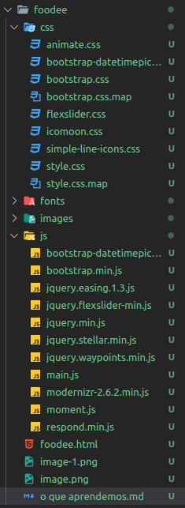
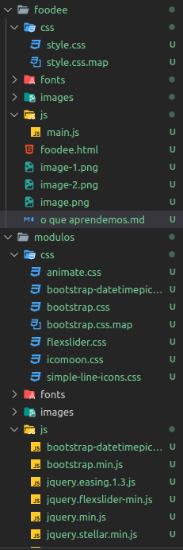
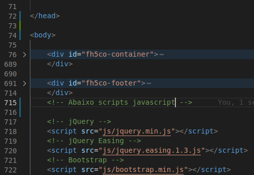
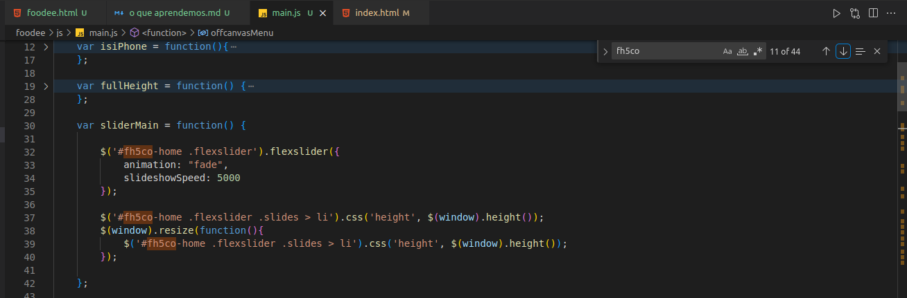

# Relatório de desenvolvimento por etapa.

### Antes de começarmos.

se você é um iniciante que nem eu talvez fique confuso com as minhas ferramentas...
fique tranquilo.

estou utilizando um editor de texto chamado Visual Studio Code por ser leve e ter muita coisa integrada, me ajuda não tendo que abrir
1500 janelas e ficar trocando entre elas e de bonus tenho extensões.

durante minha aventura tu vai perceber que eu tenho icones diferentes do teu: são as extensões. aqui vai uma lista da extensões que são "relevantes" para o projeto que vamos mecher, não recomendo ficar muito tempo buscando elas, o editor fica mais e mais pesado a cada nova extensão.
> HTML CSS Suport
>
> IntelliSense for CSS class names in HTML
> 
> Material Icon Theme
>
> Live Server
>

se quiser utilizar outras ferramentas como neo-vim( se tu gosta do msdos ), sublime, visual studio, qualquer IDE do jetbrains ou até mesmo o bloco
de notas padrão do seu computador pode ir tranquilo.

e sim... existem dois visual studios. e sim um é completamente diferente do outro.

# Vamos começ- meu deus... que bagunça...
então... lembra que o projeto original é de 6 anos atras e só podemos ver o resultado da "codagem" do pessoal? então... 
antigamente não se existia uma técnologia moderna chamada NPM, um gerenciador de pacotes.
então o pessoal só lotava as pastas de css e javascript com todo e qualquer arquivo e azar do junior.

para se começar vamos separar as livrarias de terceiros: arquivos criados por outro desenvolvedor dedicado a facilitar nossa vida. 
dando uma olhada nos arquivos da pra se perceber alguns nomes como bootstrap e animate.css e dando uma olhada o código é ilegivel ou longo de mais pra ser escrito por uma pessoa... mas dando uma olhada no google tambem confirma a origem do arquivo.



vamos remover esse "barulho" visual: toda pasta de terceiro vai para uma pasta nova, vou chama-la de "modulos". 
o importante é só deixar os arquivos que temos certeza que foram criados para este projeto/site em especifico.

começando com o css : dessa lista inteira o unico arquivo notavel é o style.css visto que ele é o resultado de todos os estilos usados na pastas sass do projeto.

ta vendo aquela pasta sass? então... conheça o typescript do css.
pra ti iniciante que não conhece typescript pensa no sass como uma liguagem de estilos que engloba o css e adiciona coisas novas para nós desenvolvedores MAS um arquivo sass não é legivel para o html então usamos uma ferramenta para compilar/traduzir o arquivo sass em um arquivo .css. 

vou manter a pasta sass de cada projeto na lista por enquanto, mas se tu ver que mudei para a pasta modulos no futuro, saiba que mudei de ideia.
provavelmente por que o sass tambem possui componentes de terceiros e não consegui encontrar o que foi criado pelo autor original.
mas em geral tu pode até deletar as pastas sass: elas são uteis apenas para ler o css e não possuem utilidade na página HTML. mas recomendo mante-las por que o produto gerado geralmente é confuso.

na lista de arquivos css o unico arquivo realmente importante é o style.css e o style.css.map (esse eu não sei para que serve.)
todos os outros arquivos eu posso colocar na pasta modulos por serem arquivos de terceiros.

a mesma coisa pode ser aplicada para as fontes em fonts e os arquivos javascript.

se quiser tu pode criar teus próprios arquivos globais, como uma script javascript que deixa o fundo de um elemento com a classe "colorido" mudar de cor aleatoriamente.

dentre as dependencias utilizadas no projeto, algumas notaveis são:

animate.css -> uma livraria para animações. FANTASTICO!! eu vou salvar essa para mais projetos no futuro, simples de usar porem verbosa
me pergunto se existem livrarias melhores/mais novas utilizando o potencial do css em 2023.

bootstrap -> um clássico. simples e sempre util.
seria melhor utilizar tailwind por gosto pessoal, mas bootstrap tambem tem um lugar especial em mim.

flexslider -> uma livraria de carrosel ou sliders para a página que pode ser usada de maneiras criativas.

e depois de aplicar esta regra o projeto foi de confuso para... 
um projeto ainda confuso, mas que pelo menos é visivel e desmenbravel.
é por isso que em projetos modernos utiliza-se o NPM e a pasta node_modules: para evitar essa bagunça enorme.

por sorte o projeto é simples e não presisamos utilizar um webpacker: uma ferramenta que junta todo o javascript em um só arquivo gigante de 50 mil linhas. torna nossa experiencia de engenharia reversa um inferno MAS para o desenvolvedor é um paraiso já que ele permite separar o código por vários arquivos evitando bagunça.

 


---------------------------------------
# Entrado na página...

>- [Visualizar a página pronta]()
>- [Código fonte original](https://github.com/toidicode/template/tree/master/01-foodee)


beleza, agora que a etapa mais importante esta concluida, podemos olhar para o projeto em si: recriar a página do [Foodee](https://github.toidicode.com/01-foodee/)

então... bela introdução... nossa isso vai ser chato de explicar...

um lembrete para só dar uma visualizada dentro do elemento header da página. todo aquele conteudo  é importante para integrar a página com redes sociais, chamar nossos arquivos de estilos e laaa no rodapé os nossos arquivos javascript. SIM é importante a ordem de como chamamos, pricipalmente para os arquivos javascript: alguns podem ser dependentes de outros.

mas indo para o importante: o corpo da página.



então. o esqueleto da página foi separado em 3 partes: 

- corpo visual
- rodapé

talves tu tenha percebido o div id="fh5co-container  no inicio da página do foode. então, da maneira como a página foi separada ele atua como nosso body. podemos até ignora-lo para testar componentes individuais MAS quando colocarmos tudo junto é melhor te-lo.


aquela introdução do [Foodee](https://github.toidicode.com/01-foodee/) é representada por este código:

```html

<div id="fh5co-home" class="js-fullheight" data-section="home">

			<div class="flexslider">

				<div class="fh5co-overlay"></div>
				<div class="fh5co-text">
					<div class="container">
						<div class="row">
							<h1 class="to-animate">foodee</h1>
							<h2 class="to-animate">Lovely Designed <span>by</span> <a href="http://freehtml5.co/"
									target="_blank">freehtml5.co</a></h2>
						</div>
					</div>
				</div>
				<ul class="slides">
					<li style="background-image: url(images/slide_1.jpg);" data-stellar-background-ratio="0.5"></li>
					<li style="background-image: url(images/slide_2.jpg);" data-stellar-background-ratio="0.5"></li>
					<li style="background-image: url(images/slide_3.jpg);" data-stellar-background-ratio="0.5"></li>
				</ul>

			</div>

		</div>

```

sim, a primeira vista tambem não entendi nada. mas a curiosidade me pegou: 

> por que temos fh5co? da onde isso surge?
>
> js-fullheight? oxe, 100vh existe, não é só usar isso?? 

vamos responder um a um: primeiramente o fh5co provavelmente é uma maneira de deixar visivel um elemento modificado pelo javascript.
indo no arquivo main.js e... bingo!



essa regra tambem se aplica para o arquivo CSS, é uma maneira do criador original de manter os estilos unicos para este site.

daqui podemos seguir por dois caminhos: análisar o css ou o javascript, de qualquer maneira iremos análisar ambos no final do dia.
